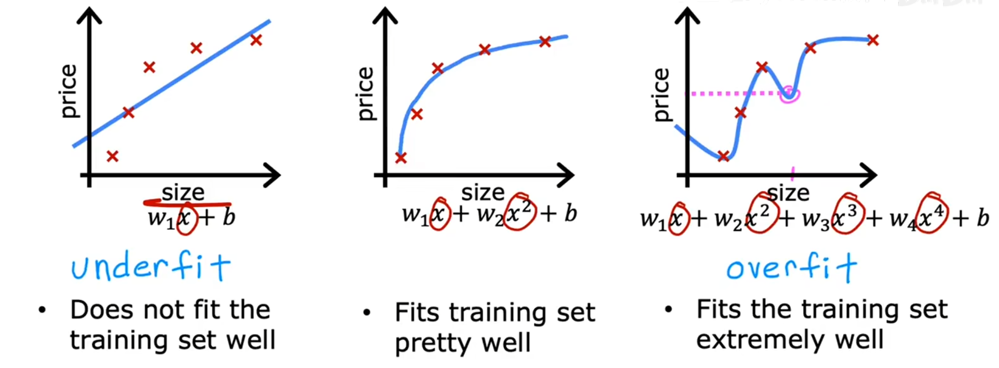

# 机器学习中的模型评估

## 一. 回归指标
###  MSE (均方误差)x

$$
\mathrm{MSE} = \frac{1}{n} \sum_{i=1}^{n} \left( y_i - \hat{y}_i \right)^2
$$

**理解**: 每个点偏离真实值多少平方单位

### RMSE (均方根误差)
$$
\mathrm{RMSE} = \sqrt{MSE}
$$

### R² (决定系数)
$$
\mathrm{R²} = 1- \frac{\sum_{i=1}^{n}\left( y_i-\hat{y}\right)}{\sum_{i=1}^{n}\left(y_i-\bar{y}\right)}
$$
**理解**: 模型解释了原本数据波动的程度，R²=1则拟合较好，小于0则很烂

## 二. K-Fold Cross Validation (K 折交叉验证)

**K 折交叉验证是一种用于评估模型泛化能力的统计方法。**
其核心思想是：将训练数据集平均分成 K 份，每次取其中 1 份作为验证集，其余 K−1 份作为训练集；重复 K 次，最终对 K 次评估结果求平均，作为模型的整体性能。
翻译就是：原本我们直接`fit(X,y)`相当于把所有的训练数据一次丢给模型，这样好是好，但是有一个问题，模型有可能会因为太过拟合原本的数据导致泛化性缺失，那么这时候通过Kfold分割数据，只给部分数据训练，再用剩下的来考验我们训练出来的模型，这样会合理很多。

```python
from sklearn.model_selection import KFold
# Use 10-fold cross validation (90% training, 10% test)
crossvalidation = KFold(n_splits=10, shuffle=True, random_state=1)
```


## 三. OverFitting (过拟合)
模型经过训练之后对数据的拟合结果过于精准，导致模型失去了泛化的能力

在图中，第一个模型存在欠拟合的情况，第三个模型存在过拟合的情况